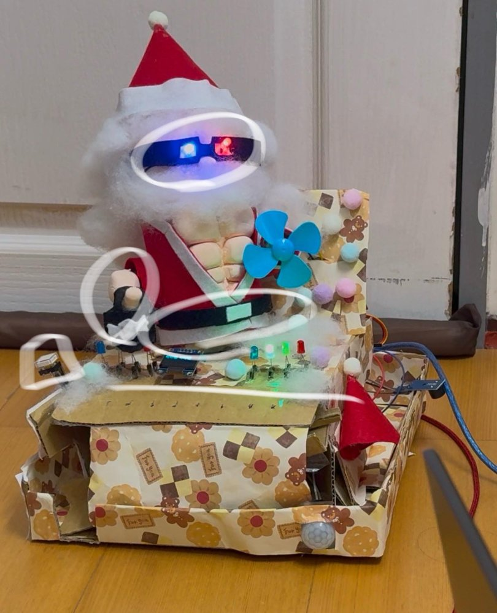
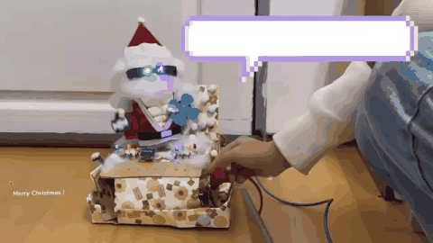
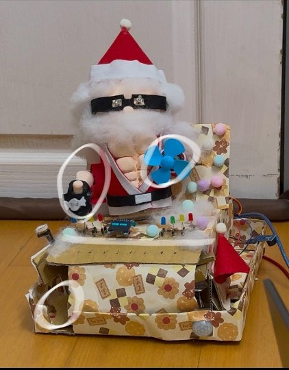
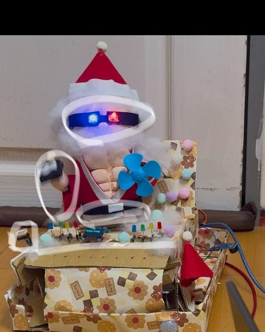
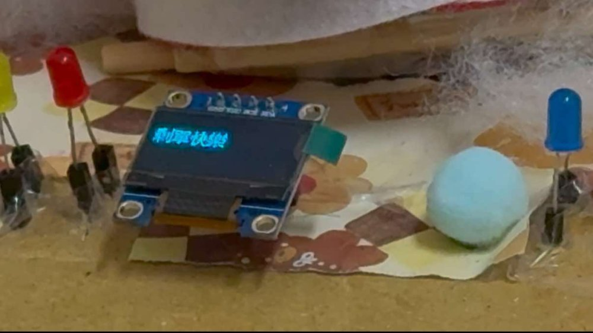
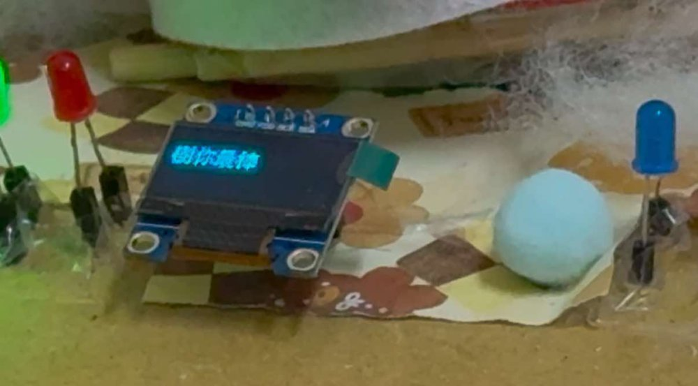
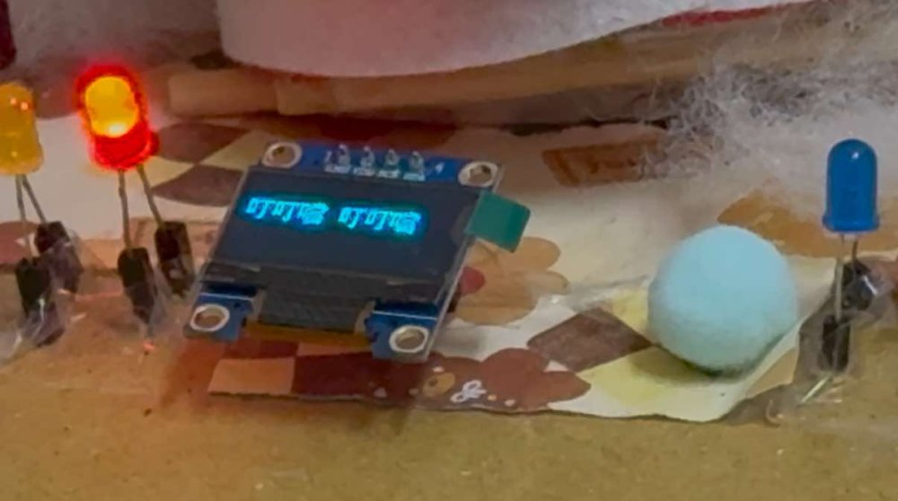
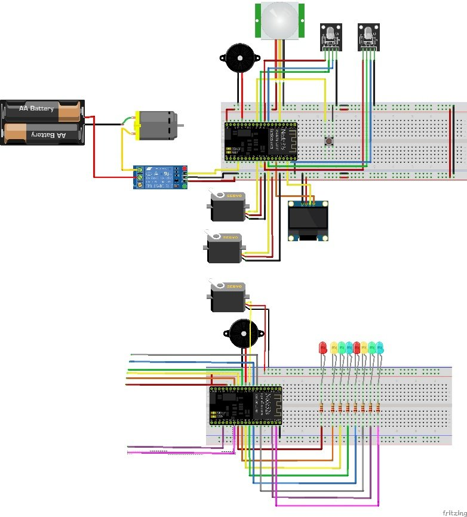

# Embedded Systems Final Project — 聖誕老人的糖果音樂工坊

<p align="center">
  
</p>

## Demo


## Introduction
本專題以兩片 **ESP32** 製作一個聖誕主題的互動裝置藝術：會招手、扭腰、送糖果、唱聖誕歌的聖誕老人
- 兩片 ESP32 連上同一個 WiFi，以 **UDP** 互傳封包，一片為 Server、一片為 Client
- 兩大模式: **感應模式**、**舞動模式**，以按鈕切換
- 常駐功能: OLED 輪播聖誕祝福、觸控小鋼琴

## Manipulation
### 感應模式（預設）
- PIR 紅外線感測到有人靠近時:
    - 聖誕老人右手招手，左手風扇轉動
    - 糖果機伺服馬達打開，掉出糖果
    - 8 顆 LED 由左至右跑馬燈
    - 蜂鳴器播放「We Wish You A Merry Christmas」
    - OLED 輪流顯示「剩單快樂」、「樹你最棒」、「叮叮噹 叮叮噹」

### 舞動模式
- 按下按鈕進入，再按一次回到感應模式
    - 聖誕老人一邊招手、一邊轉動腰身
    - 眼睛的 RGB LED 隨機變色
    - 8 顆 LED 依序: 單數慢閃 → 偶數快閃 → 單數快閃 → 偶數快閃 → 跑馬燈，循環執行

### 觸控小鋼琴
- 8 個觸控腳位對應 Do Re Mi Fa So La Si Do，碰觸時對應的 LED 亮起並發出音符

| 感應模式 | 舞動模式 |
| :---: | :---: |
|  |  |

| OLED 顯示 | | |
| :---: | :---: | :---: |
|  |  |  |

## Code
### 架構
```
Server ESP32 (PIR / 按鈕 / 手、腰伺服馬達 / 風扇 / OLED / 眼睛 RGB LED)
   │  UDP :8888  "motion_detected" / "button_pressed" / "button_released"
   ▼
Client ESP32 (8 顆 LED / 觸控鋼琴 / 蜂鳴器 / 糖果機伺服馬達)
   │  UDP :12345 "touch:<index>"
   ▼
Server
```

### Server `server/server.ino`
- `loop()` 偵測按鈕邊緣切換模式，並依模式處理 PIR、伺服馬達與 RGB LED
- `handleSongPlayback()`: 以 `millis()` 非阻塞播放聖誕歌曲，不會卡住其他動作
- `displayMessage()`: 使用 `U8g2` 以中文字型在 OLED 輪播祝福語
- `sendMotionDetected()`、`sendButtonPressed()`、`sendButtonReleased()`: 以 UDP 通知 Client

### Client `client/client.ino`
- `touchRead()` 讀取觸控值，低於門檻即觸發 `handleTouch()`: 亮 LED、播放音符、回傳 `touch:<index>`
- 收到 `motion_detected` 執行 `runMarquee()` 跑馬燈
- 收到 `button_pressed` / `button_released` 以 `startMotorMode()` / `stopMotorMode()` 開關特殊閃爍
- `handleMotorMode()`: 以狀態機（step 1~5）控制慢閃、快閃與跑馬燈的節奏

### 電路圖


| 元件 | 所在 | 腳位 |
| --- | --- | --- |
| PIR 紅外線感測器 | Server | GPIO34 |
| 繼電器（風扇） | Server | GPIO15 |
| 按鈕 | Server | GPIO27 |
| RGB LED ×2（眼睛） | Server | 25/26/33、18/19/23 |
| OLED (I2C) | Server | SDA 21、SCL 22 |
| 觸控 ×8 | Client | 13, 12, 14, 27, 33, 32, 15, 4 |
| LED ×8 | Client | 16, 17, 5, 18, 19, 21, 22, 23 |
| 蜂鳴器 | Client | GPIO26 |
| 伺服馬達（糖果機） | Client | GPIO25 |

## How to Run
1. Arduino IDE 安裝 ESP32 開發板、`ESP32_Servo`、`U8g2` 函式庫
2. 在兩份程式填入 WiFi 名稱與密碼（`YOUR_WIFI_SSID`、`YOUR_WIFI_PASSWORD`）
3. 燒錄後從序列埠查看兩片 ESP32 的 IP，分別填入 `server.ino` 的 `clientIP` 與 `client.ino` 的 `serverIP`，重新燒錄
